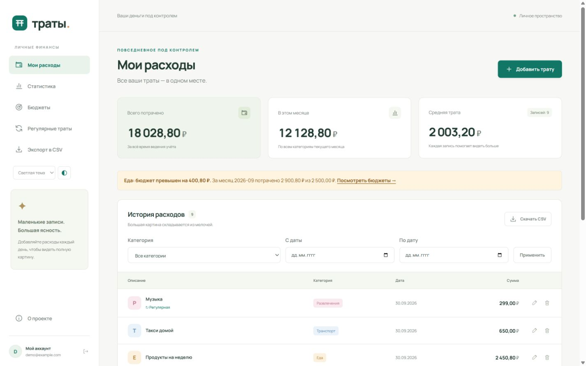
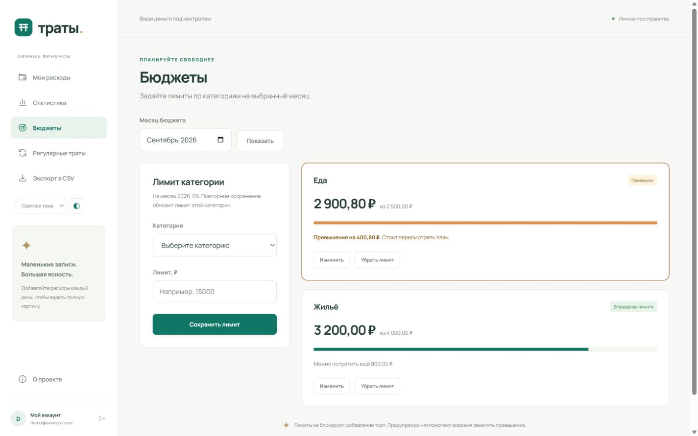
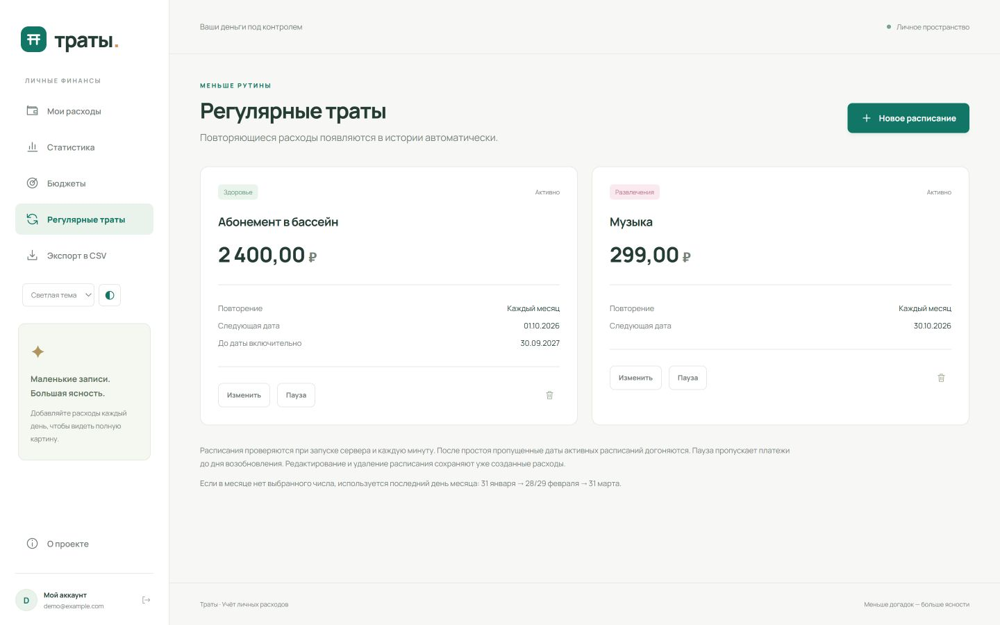
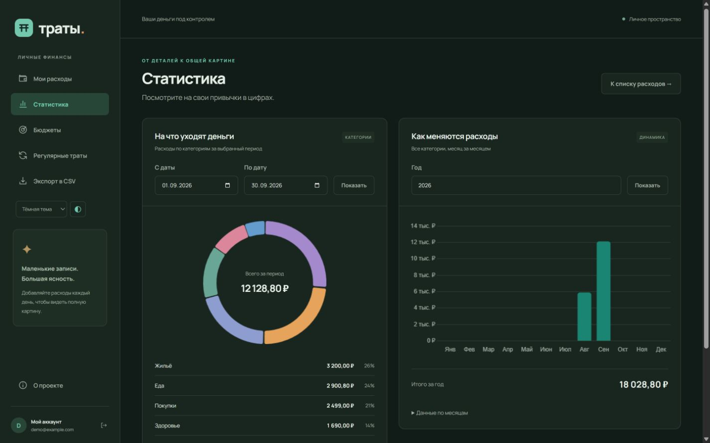
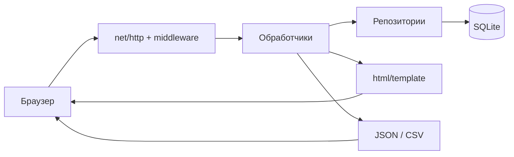
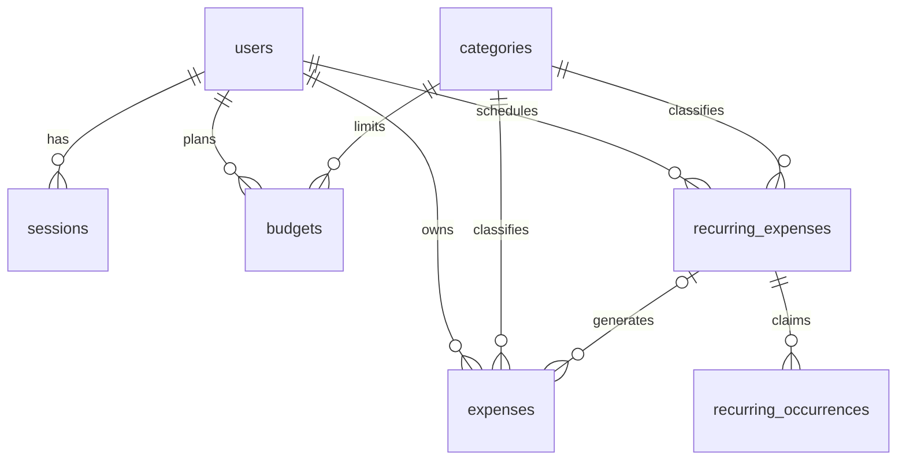
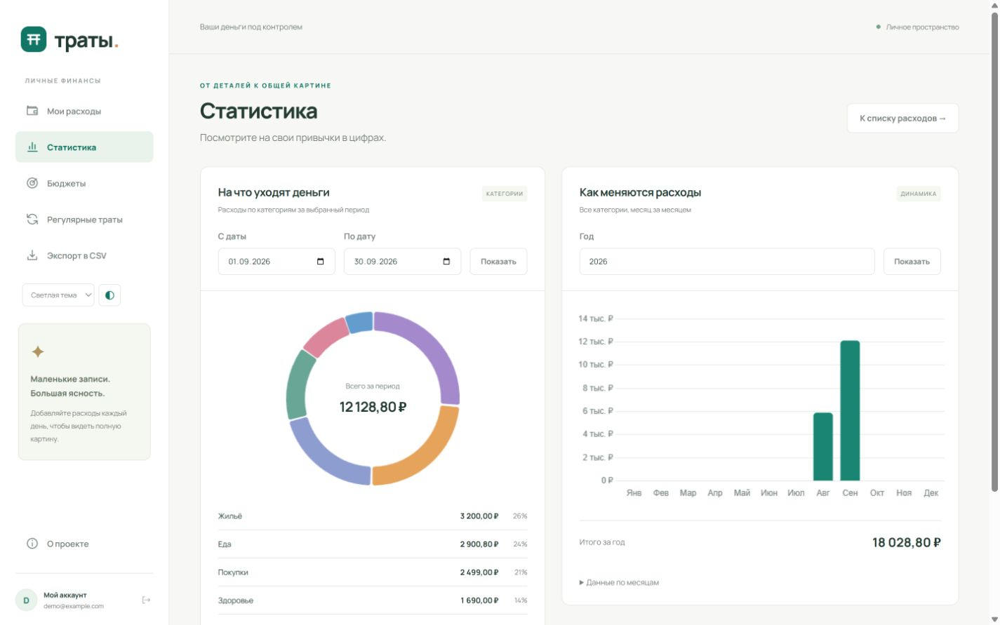

# Траты — учёт личных расходов

[](https://github.com/El1syum/tksu_pl/actions/workflows/ci.yml)

Готовое многопользовательское веб-приложение на Go по семестровому ТЗ «Учёт личных трат». Все восемь этапов объединены в один проект: серверный HTML-интерфейс, постоянная база SQLite, аккаунты, графики и CSV. Реализованы все четыре дополнительных задания: бюджеты, регулярные траты, тёмная тема и Docker.

**Сайт: [integradar.org](https://integradar.org).** Для начала зарегистрируйте собственный аккаунт. Общего демонстрационного пароля нет; тестовые расходы на скриншотах созданы в локальной среде.



## Что умеет приложение

- Регистрация, вход и выход; каждый пользователь видит только свои расходы.
- Добавление, просмотр, редактирование и удаление с отдельной страницей подтверждения.
- Восемь категорий: еда, транспорт, жильё, развлечения, здоровье, покупки, образование, другое.
- Фильтрация по категории и датам, включительно. Фильтры можно сочетать и сохранять в URL.
- Пагинация по 25 записей. Сумма и средняя рассчитываются по всему отфильтрованному набору, а не только по странице.
- Сводка за текущий месяц по всем категориям.
- Круговая диаграмма по категориям за период и столбчатая по 12 месяцам выбранного года.
- Экспорт всех или отфильтрованных расходов в CSV, совместимый с русской локалью Excel/LibreOffice.
- Серверная валидация, сохранение заполненной формы при ошибке, собственные страницы 404 и 500.
- Бюджеты по категориям на месяц: остаток, индикатор использования и предупреждение при превышении.
- Повторяющиеся траты: день, неделя, месяц или год; редактирование, пауза и дата окончания.
- Светлая, тёмная и системная темы с сохранением выбора.
- Адаптивный интерфейс. Основные формы, список и CSV работают без JavaScript; он нужен для графиков и кнопки показа пароля.

## Стек

Go 1.27+ (сборка проверена на **1.27.1**), стандартные `net/http`, `html/template`, `database/sql`, `encoding/csv`, `encoding/json`, `log/slog`.

Зависимости Go: `modernc.org/sqlite` 1.60.1 (без CGO), `golang.org/x/crypto` 0.57.0 (bcrypt), `github.com/joho/godotenv` 1.5.1. Точные версии закреплены в `go.mod`/`go.sum`.

Chart.js **4.5.1** загружается через CDN jsDelivr с проверкой SRI. При ошибке или таймауте используется включённая в проект копия той же версии. Шрифт Manrope хранится локально; лицензии ресурсов приложены. CSS, JavaScript, шрифты, шаблоны и миграции встроены в бинарный файл через `go:embed`. У CSS и JS есть версия в URL для обновления кэша при выпуске новой сборки.

## Быстрый запуск

Нужны [Go](https://go.dev/dl/) 1.27+ и Git. Node.js, npm, C-компилятор и отдельно установленный SQLite не нужны.

```sh
git clone https://github.com/El1syum/tksu_pl.git
cd tksu_pl
```

Создайте конфигурацию с новым случайным секретом.

**Windows, PowerShell:**

```powershell
./scripts/init-env.ps1
go run .
```

**Linux/macOS:**

```sh
sh scripts/init-env.sh
go run .
```

Откройте [localhost:8080](http://localhost:8080). Скрипт не перезаписывает существующий `.env`. При первом запуске автоматически создаются каталог `data`, база, таблицы и начальные категории. При следующих запусках существующая база сохраняется.

Альтернативная точка входа и сборка:

```sh
go run ./cmd/server
go build -o tksu-pl ./cmd/server
```

На Windows расширение собранного файла — `.exe`. Запускайте программу из каталога с `.env` либо передавайте настройки через окружение. Остановка: `Ctrl+C`; сервер корректно завершает активные запросы.

### Переменные окружения

| Переменная | Назначение | Пример для разработки |
| --- | --- | --- |
| `HOST` | Интерфейс прослушивания; пустое значение означает все интерфейсы | `127.0.0.1` |
| `PORT` | Порт, обязательное целое число 1–65535 | `8080` |
| `DATABASE_PATH` | Путь к файлу SQLite, обязательный | `./data/expenses.db` |
| `SESSION_SECRET` | Случайный секрет от 32 символов для HMAC сессий и CSRF | Генерируется скриптом |
| `COOKIE_SECURE` | Разрешать cookie только через HTTPS | `false` локально, `true` на сервере |
| `PUBLIC_URL` | Точный внешний origin без пути; используется при проверке Origin | `http://localhost:8080` |
| `TZ` | Часовой пояс процесса, определяющий текущую дату/месяц | На сервере `Europe/Moscow` |

Переменные процесса имеют приоритет над `.env`. Для ручной настройки скопируйте `.env.example` и заполните `SESSION_SECRET`, например результатом `openssl rand -hex 32`. Секретов и рабочих баз в Git нет. Изменение секрета завершит ранее выданные сессии.

Для корректной проверки Origin открывайте приложение именно по адресу `PUBLIC_URL`. Например, `localhost` и `127.0.0.1` — разные origin.

### Docker

После создания `.env`:

```sh
docker compose up --build -d
docker compose logs -f app
docker compose down
```

Локальный Compose публикует порт только на `127.0.0.1`. Данные хранятся в named volume `expenses` и переживают пересоздание контейнера. Не добавляйте `-v` к `docker compose down`, если хотите сохранить базу. В контейнере приложение слушает 8080, а наружный порт берётся из `.env`.

## Дополнительные задания: как пользоваться

**Бюджеты.** Откройте «Бюджеты», выберите месяц, категорию и сумму. Повторное сохранение меняет лимит этой категории в выбранном месяце. Лимит учитывает все собственные траты категории за календарный месяц, включая созданные расписанием; в следующий месяц он автоматически не переносится. Достижение и превышение показываются на странице бюджетов, предупреждение за текущий месяц — также над списком расходов независимо от его фильтров. Удаление лимита не удаляет расходы.

**Регулярные траты.** Создайте расписание с суммой, категорией, частотой и первой датой (сегодня или позже). Расход за сегодня появляется сразу, будущие — при наступлении даты. Сервер проверяет расписания при запуске и каждую минуту в часовом поясе `TZ`. После простоя активные расписания догоняются, не более 1000 дат за проход; следующий проход продолжает обработку. Для 31-го числа используется последний день короткого месяца, затем исходное число восстанавливается. Аналогично обрабатывается 29 февраля.

Пауза пропускает даты до дня возобновления. Редактирование приостановленного расписания сохраняет паузу; после изменения завершённого расписания его можно возобновить, если остались допустимые даты. Изменение суммы/категории действует на будущие начисления. Уже созданные расходы можно изменять отдельно; удаление расписания сохраняет историю. Транзакция и уникальная пара «расписание + дата» предотвращают дубли после рестарта или ошибки. Даже удалённая вручную трата не начисляется повторно за ту же дату. Это запись расходов, без списаний с банковского счёта.

**Тема.** Выберите светлую, тёмную или системную тему и нажмите кнопку рядом с выбором. Предпочтение хранится год в cookie браузера и сохраняется после выхода/входа. Системная тема следует настройке устройства, включая цвета графиков. Переключение работает без JavaScript.

**Docker.** Приложены Dockerfile и Compose с постоянным томом. CI не только собирает образ, но и запускает его с новой базой для полного HTTP-сценария. Публичный сайт работает в контейнере с постоянной БД вне образа.







## Устройство проекта

```text
main.go                     запуск через go run .
cmd/server/main.go          отдельная точка входа сервера
internal/app/               сборка компонентов, HTTP-сервер, graceful shutdown
internal/config/            .env, окружение, проверка конфигурации
internal/models/            модели, точный разбор денежных сумм, даты
internal/repository/        SQL, миграции, CRUD, пользователи, сессии, агрегации
internal/handlers/          маршруты, формы, API, экспорт и middleware
migrations/                версионируемая SQL-схема и начальные категории
web/templates/             общий layout и HTML-страницы
web/static/                CSS, JS и локальные зависимости
scripts/                   создание .env и HTTP smoke-проверка
deploy/                    развёртывание, Compose и пример Caddy
docs/                      аудит ТЗ, презентация, сценарий защиты и скриншоты
.github/workflows/ci.yml    тесты, race detector, vet и Docker-сборка
```



SQL сосредоточен в репозиториях. `ExpenseRepository` содержит `Create`, `GetAll`, `GetByID`, `Update`, `Delete`, `Categories`, `Totals`, `ByCategory`, `ByMonth`. Обработчики не собирают SQL и не обращаются к БД напрямую.

### База данных

Схема: [основная миграция](migrations/001_initial.sql) и [бюджеты/расписания](migrations/002_budgets_recurring.sql). Миграции выполняются транзакционно; применённые файлы отмечаются в `schema_migrations`.

| Таблица | Основные поля и назначение |
| --- | --- |
| `users` | `id`, уникальный `email`, `password_hash`, дата создания |
| `categories` | `id`, `name`, `color`, `icon`; общий справочник |
| `expenses` | `id`, `user_id`, `category_id`, `amount`, `description`, `date`, необязательный `recurring_id` |
| `sessions` | HMAC идентификатора сессии, `user_id`, `expires_at` |
| `budgets` | `user_id`, `category_id`, `month`, `amount`; один лимит категории на месяц |
| `recurring_expenses` | Пользователь, категория, сумма, описание, частота, исходная/следующая/конечная дата, активность |
| `recurring_occurrences` | Пара «расписание + дата» исключает повторное начисление |
| `schema_migrations` | Имена уже выполненных SQL-миграций |



`amount` — целое количество **копеек**, а не `float64`. Например, 125,50 ₽ хранится как `12550`. Допустима сумма 0,01–999 999 999,99 ₽, максимум два знака после запятой. Средняя в интерфейсе округляется вниз до копейки. Даты хранятся как `YYYY-MM-DD`, годы 1900–9999, описание — 1–300 символов.

Включены внешние ключи, WAL и `busy_timeout=5000`. Одно открытое соединение упрощает согласованность настроек SQLite и сериализует запись. Индексы ускоряют выборки по пользователю, категории и датам. Списки используют JOIN, статистика — SQL `SUM`/`COUNT`/`GROUP BY`.

### Маршруты

| Метод и маршрут | Назначение |
| --- | --- |
| `GET /` | Приветственная страница, 200 |
| `GET /about` | Описание проекта |
| `GET /ping` | `200`, текст `pong`; другие методы — `405`, `Allow: GET` |
| `GET, POST /register` | Регистрация |
| `GET, POST /login` | Вход |
| `POST /logout` | Удаление сессии |
| `GET /expenses` | Список; параметры `category`, `from`, `to`, `page` |
| `GET /expenses/new`, `POST /expenses` | Создание |
| `GET, POST /expenses/{id}/edit` | Редактирование |
| `GET, POST /expenses/{id}/delete` | Подтверждение и удаление |
| `GET /stats` | Страница двух графиков |
| `GET /api/stats/by-category?from=2026-09-01&to=2026-09-30` | Суммы по категориям |
| `GET /api/stats/by-month?year=2026` | Суммы по месяцам, включая нулевые |
| `GET /expenses/export` | CSV; поддерживает те же фильтры, кроме пагинации |
| `GET /budgets?month=2026-09`, `POST /budgets` | Лимиты категорий на месяц |
| `POST /budgets/{id}/delete` | Удалить свой лимит категории за месяц из формы |
| `GET /recurring`, `GET /recurring/new`, `POST /recurring` | Список и создание расписания |
| `GET, POST /recurring/{id}/edit` | Редактирование расписания |
| `POST /recurring/{id}/pause`, `POST /recurring/{id}/resume` | Пауза/возобновление |
| `GET, POST /recurring/{id}/delete` | Подтверждение и удаление расписания |
| `POST /theme` | Выбор оформления, в том числе до входа |
| `GET /static/...` | Статические файлы |

Расходы, бюджеты, расписания, экспорт, статистика и выход требуют авторизации. HTML-запрос без сессии перенаправляется на вход, JSON API возвращает `401`. API передаёт суммы в **копейках**:

```json
[{"name":"Еда","color":"#e6a35b","amount":12550,"count":1}]
```

### Сессии и обработка ошибок

- Пароли хэшируются bcrypt с cost 10; длина 10–72 байта, пароль никогда не возвращается в форму или лог.
- Сессионный токен: 32 случайных байта из `crypto/rand`; в SQLite хранится только его HMAC-SHA256. Срок — 7 дней, проверяется на каждом запросе. Выход инвалидирует токен в БД.
- Cookie: `HttpOnly`, `SameSite=Lax`, `Secure` в HTTPS-окружении. Cookie не хранит ID пользователя или пароль.
- POST-формы защищены подписанным CSRF-токеном и проверкой Origin. Изменение данных через GET невозможно.
- ID пользователя приходит только из контекста проверенной сессии. Все чтения/изменения/агрегации расходов, бюджетов и расписаний ограничены `user_id`; чужой ID возвращает 404.
- Значения SQL передаются через `?`. HTML экранируется `html/template`. CSP разрешает скрипты своего origin и точный URL закреплённого Chart.js; встраивание сайта во фреймы запрещено.
- До 10 попыток входа на один email за 15 минут; счётчики ограничены по размеру и очищаются от истёкших записей. Это базовое ограничение для учебного проекта, оно сбрасывается при перезапуске процесса.
- Успешный POST заканчивается `303 See Other` (Post/Redirect/Get). Ошибка полей — `422` с заполненной формой; неверные фильтры — `400`; CSRF — `403`; превышение размера формы — `413`.
- Middleware пишет метод, путь, статус и длительность в JSON-лог. Тело запроса, cookie и пароли не логируются. `recover` перехватывает панику и отдаёт HTML 500.

CSV: UTF-8 с BOM, разделитель `;`, десятичная запятая, CRLF, имя `expenses-YYYY-MM-DD.csv`. Потенциальные формулы в текстовых ячейках получают начальный апостроф. Если табличный редактор использует другую локаль, укажите разделитель `;` при импорте.

## Проверка

```sh
go test ./...
go vet ./...
go test -race -cover ./...
python scripts/smoke.py http://localhost:8080
```

Race detector требует поддерживаемую платформу и C-компилятор; он запускается в GitHub Actions на Ubuntu. Обычная сборка и обычные тесты не требуют CGO.

Тесты проверяют CRUD, изоляцию пользователей, срок и отзыв сессий, bcrypt, CSRF/Origin, XSS-экранирование, фильтры и границы дат, точность сумм, агрегации, пагинацию, CSV и формулы, обработку паники, конкурентные записи и повторное открытие базы. Для дополнительных функций проверяются границы месяцев, високосные годы, пауза, дедупликация начислений, конкурентные планировщики, атомарный откат при ошибке, обновление старой схемы и сохранение темы.

Smoke-скрипт проверяет настоящий HTTP-сервер и создаёт два одноразовых тестовых аккаунта. В сценарий входят также бюджеты, автоматическое начисление, пауза/возобновление и тема. Тестовые траты, лимиты и расписания удаляются, сессии закрываются; email для точечной очистки выводятся в конце. Не используйте реальные личные данные для проверок.

Чтобы проверить запуск с чистой БД, создайте отдельную конфигурацию с новым `DATABASE_PATH`, например `./data/fresh-check.db`. Удалять рабочую базу не нужно.

## Развёртывание на el1s

Домен [integradar.org](https://integradar.org) обслуживается существующим Caddy с TLS. Приложение работает отдельным непривилегированным контейнером `tksu-pl`, порт сервера `127.0.0.1:8095`, внутренняя Docker-сеть `botmost_web`. Предыдущий контейнер `integradar-web` остановлен, его файлы сохранены.

```powershell
./deploy/deploy.ps1 -Server el1s
```

Можно передать `-Go 'C:\path\to\go.exe'` и уникальный `-ReleaseTag`. Скрипт проверяет тесты и vet, собирает Linux amd64 без CGO, копирует архив по SSH, делает согласованную резервную копию SQLite, собирает компактный runtime-образ и проверяет `/ping`. Если новая версия не проходит проверку, запускается предыдущий образ. Скрипт не меняет домены при повторных обновлениях.

| Путь на сервере | Содержимое |
| --- | --- |
| `/opt/tksu-pl/current` | Символическая ссылка на текущий выпуск |
| `/opt/tksu-pl/releases/<tag>` | Бинарник, runtime Dockerfile, Compose, SHA исходников |
| `/opt/tksu-pl/shared/.env` | Конфигурация и случайный серверный секрет, права 600 |
| `/opt/tksu-pl/shared/data/expenses.db` | Рабочая SQLite, каталог принадлежит UID 10001 |
| `/opt/tksu-pl/backups` | Согласованные снимки БД перед обновлением и старый Caddyfile |

```sh
ssh el1s 'sudo docker logs --tail 50 tksu-pl'
ssh el1s 'sudo docker inspect tksu-pl --format "{{.State.Health.Status}}"'
curl https://integradar.org/ping
```

Файловая система контейнера доступна только для чтения, кроме `/data` и временного `/tmp`. Убраны Linux capabilities, запрещено повышение привилегий, установлены лимиты ресурсов и ротация логов. Рабочая БД находится вне контейнера.

Порядок переноса домена, резервного копирования и возврата предыдущего приложения: [docs/operations.md](docs/operations.md). Восстановление старого образа автоматически не отменяет миграции БД; перед изменением схемы проверяйте совместимость или восстанавливайте согласованный снимок.

## Соответствие ТЗ и защита

| Этап | Итог в этом проекте |
| --- | --- |
| 1. Go и HTTP | Go modules, `net/http`, `/`, `/about`, `/ping`, коды и методы |
| 2. Шаблоны | Слои проекта, общий layout, формы, PRG; временный срез заменён итоговым хранилищем |
| 3. SQLite | Миграция, `database/sql`, `ExpenseRepository`, постоянный CRUD |
| 4. Категории | Общий справочник, FK, JOIN и комбинируемые фильтры |
| 5. Авторизация | Регистрация, bcrypt, cookie-сессии в SQLite, middleware и context |
| 6. Статистика | Два JSON API, SQL-агрегации, fetch и два графика Chart.js |
| 7. Ошибки | Валидация, заполненные формы, logging/recover, 404/500 |
| 8. Завершение | CSV, .env, адаптивный CSS, README, проверки и развёртывание |

Подробная сверка каждого практического пункта и сдаваемых материалов: [аудит ТЗ](docs/requirements-audit.md).

Презентация на 5–7 минут: [PowerPoint](docs/presentation.pptx) · [PDF](docs/presentation.pdf). В PPTX есть заметки докладчика. Пересборка материалов: `python scripts/build-presentation.py` (только для презентации нужны `python-pptx`, `reportlab`, `Pillow`; приложение от Python не зависит).

Материалы: [пояснительная записка и сценарий защиты на 5–7 минут](docs/defense.md), [протокол проверки](docs/verification.md), [скриншоты](docs/screenshots).



## Источники и лицензии

Документация: [Go net/http](https://pkg.go.dev/net/http), [html/template](https://pkg.go.dev/html/template), [database/sql](https://pkg.go.dev/database/sql), [SQLite](https://www.sqlite.org/docs.html), [modernc.org/sqlite](https://pkg.go.dev/modernc.org/sqlite), [Chart.js](https://www.chartjs.org/docs/latest/).

Лицензии включённых ресурсов: [Chart.js MIT](web/static/vendor/Chart.js-LICENSE.md), [Manrope OFL](web/static/vendor/Manrope-LICENSE.txt).
